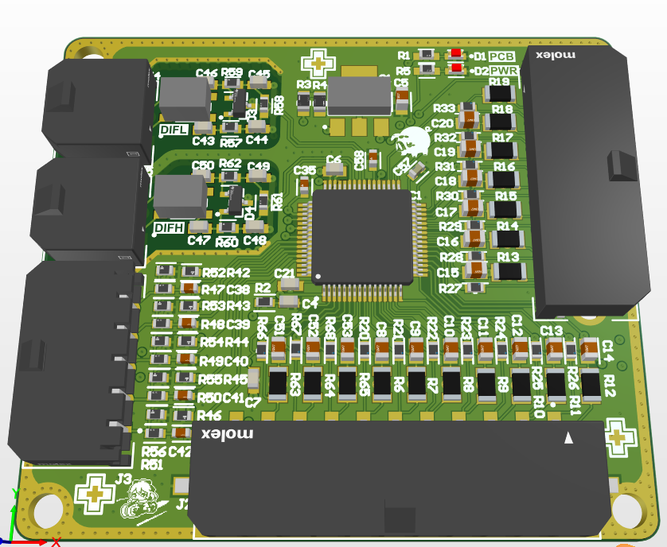
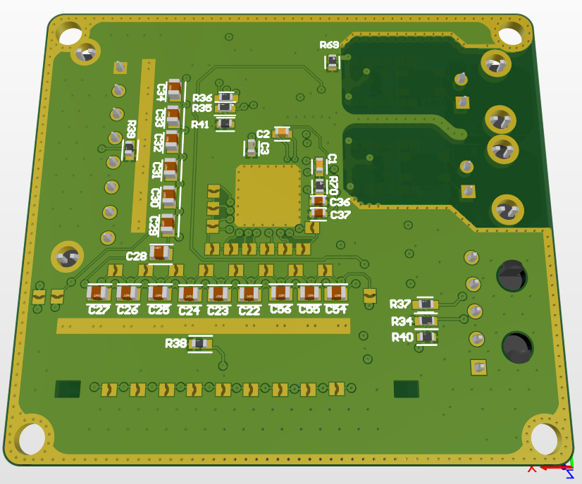
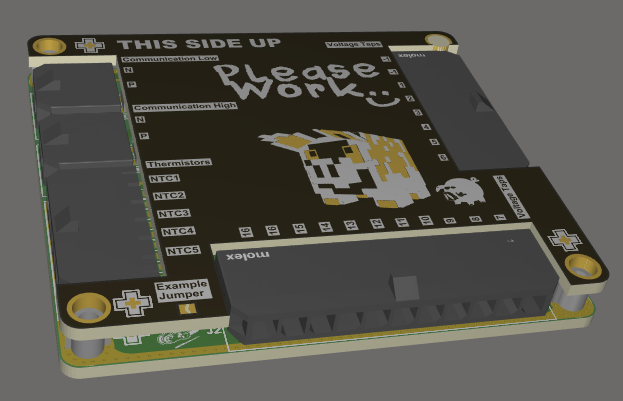
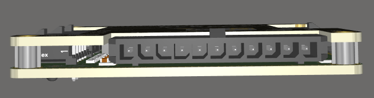

### BMS Slave Board
Uses the TI BQ79616-Q1 battery management chip in a stack configuration, communicating with a separate master board. Supports from 3 to 16 cells, configurable by solder jumpers on the back of the board. Can hook up up to 5 external NTC thermistors and has 2 board NTC thermistors for internal measurements.

